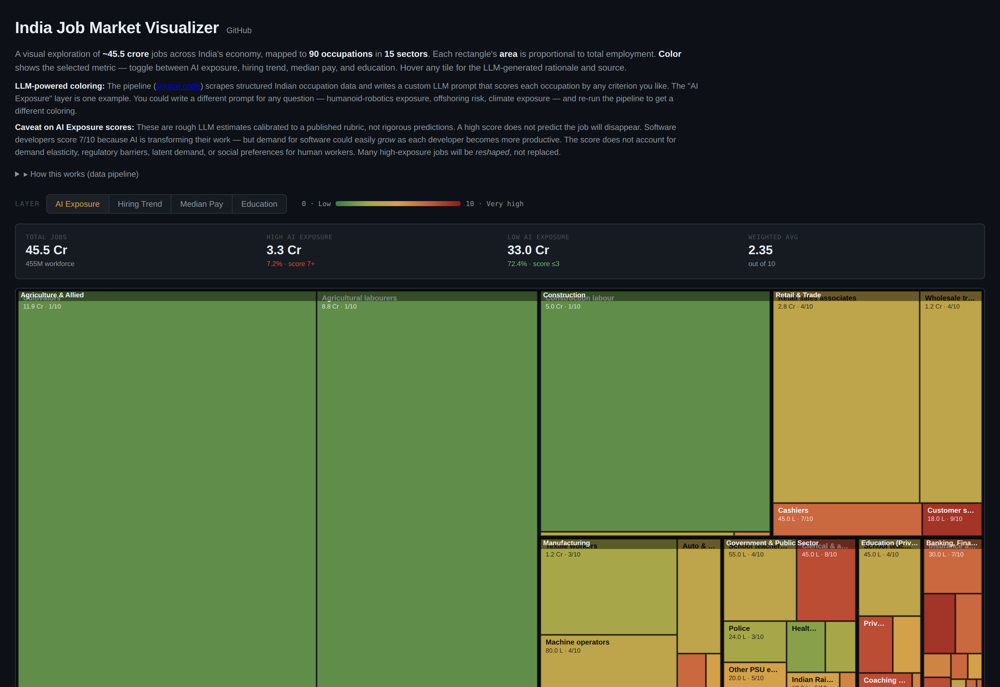

# AI Exposure of the Indian Job Market

Analyzing how susceptible every occupation in the Indian economy is to AI and automation, using data from PLFS (MOSPI), NASSCOM Strategic Review, NSDC Sector Skill Councils, NASSCOM-Zinnov GCC Landscape Report, and individual company filings.

**Live demo:** [tonumoy.github.io/India-Jobs](https://tonumoy.github.io/India-Jobs/) *(once you enable GitHub Pages — see Deploy section below)*

**New here? Read [QUICKSTART.md](QUICKSTART.md) first.** It explains exactly what's happening, what LLM is in use, and gives you a 5-minute path to a live site.



Heavily inspired by Andrej Karpathy's [US Job Market Visualizer](https://karpathy.ai/jobs/) ([source](https://github.com/karpathy/jobs)). Same pipeline architecture, India-localized data and rubric.

## Current state of `data/scores.json`

The scores shipped in this repo are **expert estimates calibrated to the rubric in `pipeline/make_prompt.py`**, not live LLM output. They are reasonable starting points that allow the site to deploy out of the box without an API key.

To regenerate scores from a live LLM (default: Google Gemini 2.5 Flash via OpenRouter), set `OPENROUTER_API_KEY` in `.env` and run `make rescore` (or `uv run python pipeline/score.py --force`). Any OpenRouter model works — pass `--model anthropic/claude-3.5-sonnet` etc.

## What's here

India has no single equivalent of the US Bureau of Labor Statistics' Occupational Outlook Handbook. So this repo merges multiple Indian sources into a unified dataset of **214 occupations covering ~554 million workers across 22 sectors**, scores each one's AI exposure using an LLM with an India-specific rubric, and renders the result as an interactive treemap.

## Data pipeline

```
   ┌──────────────────────────┐
   │  Indian data sources     │
   │  ────────────────────    │
   │  PLFS 2023-24 (MOSPI)    │
   │  NASSCOM SR 2025         │
   │  NASSCOM-Zinnov GCC      │
   │  NSDC SSC reports        │
   │  Company FY25 filings    │
   │  TeamLease Digital       │
   └────────────┬─────────────┘
                │  hand-curated
                ▼
   ┌──────────────────────────┐
   │  data/occupations.json   │  ← Master list (214 occupations, 22 sectors)
   └────────────┬─────────────┘
                │
                ├──► pipeline/process.py   ─►  pages/*.md (rich descriptions)
                │
                ├──► pipeline/make_csv.py  ─►  data/occupations.csv
                │
                ▼
   ┌──────────────────────────┐
   │  pipeline/score.py       │  ← OpenRouter LLM call per occupation
   │  ──────────────────      │     using the rubric in make_prompt.py
   │  Reads: pages/*.md       │
   │  Writes: scores.json     │
   └────────────┬─────────────┘
                │
                ▼
   ┌──────────────────────────┐
   │  build_site_data.py      │  ← Merges occupations + scores
   └────────────┬─────────────┘
                │
                ▼
   ┌──────────────────────────┐
   │  data.json               │  ← Compact merged data
   │  index.html              │  ← The treemap (D3.js)
   └──────────────────────────┘
```

1. **Scrape / curate** (`scrape.py`, `data/occupations.json`) — Skeleton scrapers for NCO 2015 (PDF), NSDC Sector Skill Council reports, and the National Career Service portal. The seed dataset in `data/occupations.json` is hand-curated from these sources; the scrape scripts are templates to extend it.
2. **Process** (`process.py`) — Generates rich Markdown descriptions for each occupation in `pages/`. For 8+ key occupations (TCS engineers, BPM voice agents, content writers, etc.) the descriptions include hand-researched industry context. The rest are templated.
3. **Tabulate** (`make_csv.py`) — Flattens the data into `data/occupations.csv` for spreadsheet exploration.
4. **Score** (`score.py`) — Sends each occupation's Markdown description to an LLM (default: Gemini Flash via OpenRouter) with the rubric in `make_prompt.py`. Each occupation gets an AI Exposure score from 0–10 plus a rationale. Results saved to `data/scores.json`. **Fork this to write your own prompts.**
5. **Build site data** (`build_site_data.py`) — Merges occupations + scores into a compact `data.json` at the repo root for the frontend.
6. **Website** (`index.html`) — Interactive treemap visualization where area = employment and color = the selected metric (AI exposure / hiring trend / median pay / education). Loads `data.json` at runtime.

## Key files

| File | Description |
|---|---|
| `data/occupations.json` | Master list of 90 Indian occupations with employment, pay, education, hiring trend, source |
| `data/occupations.csv` | Flat spreadsheet view |
| `data/scores.json` | LLM AI-exposure scores (0–10) with rationales |
| `pages/*.md` | Rich Markdown descriptions, one per occupation (LLM input) |
| `pipeline/make_prompt.py` | The India-specific scoring rubric (the heart of the system) |
| `pipeline/score.py` | LLM scoring loop (OpenRouter, resumable) |
| `index.html` | Treemap visualization (D3.js, single-file frontend) |
| `data.json` | Compact merged data the frontend reads |

## AI exposure scoring

Each occupation is scored on a single **AI Exposure** axis from 0 to 10, measuring how much AI will reshape that occupation. The full rubric is in `pipeline/make_prompt.py`. Calibration anchors:

| Score | Meaning | Indian examples |
|---|---|---|
| 0-1 | Minimal | Cultivators, construction labour, agricultural labourers |
| 2-3 | Low | Doctors, nurses, police, truck drivers, school teachers |
| 4-5 | Moderate | Civil engineers, retail sales, branch managers, machine operators |
| 6-7 | High | Software engineers (TCS/Infosys/Wipro), accountants, junior lawyers, financial advisors |
| 8-9 | Very high | Bank clerks, paralegals, content writers, journalists, travel agents |
| 10 | Maximum | Voice call-centre agents, data entry, basic translation |

**Average exposure weighted by employment is much lower than Karpathy's US figure of ~5.3/10**, because the Indian workforce is disproportionately in low-exposure agriculture, construction, and physical / informal work. But within the **formal/cognitive economy** (~80M jobs), the picture inverts — AI exposure is concentrated exactly in India's export specialty (IT services, BPM, KPO, GCC back-office). The dashboard shows the live weighted average for the current dataset.

### India-specific factors the rubric accounts for

The prompt in `make_prompt.py` instructs the LLM to weight:

- **Wage arbitrage erosion** — Indian fresher developer at ₹5L/year competing with $500/year of GitHub Copilot
- **Service-export composition** — Goldman Sachs (2023) identifies 46% of office-and-administrative-support and 44% of legal tasks as automatable, which maps directly onto India's $224B service-export economy
- **Regulatory and informal-sector protection** — Government clerical staff have high task exposure but employment is protected; this is scored as high exposure with a note
- **Infrastructure constraints** — Robotics adoption in Indian manufacturing lags because labor is cheaper than capital

## Visualization

The treemap (`index.html`):

- **Area** of each rectangle = total employment in that occupation
- **Color** = the selected metric (AI exposure / hiring trend / median pay / education)
- **Hover** any tile for full details: employment, AI score, hiring trend, median pay, education, the LLM's rationale, and the primary data source
- **Toggle** between four layers via the buttons at the top

## Setup

```bash
# Clone
git clone https://github.com/Tonumoy/India-Jobs
cd India-Jobs

# Install (uses uv — install from https://github.com/astral-sh/uv if needed)
uv sync
```

To run the LLM scoring step you need an OpenRouter API key. The seed scoring is already included in `data/scores.json` so you can skip this and go straight to building & viewing.

```bash
# Optional: re-score with your own LLM
echo "OPENROUTER_API_KEY=sk-or-..." > .env
```

Get a free OpenRouter key at [openrouter.ai/keys](https://openrouter.ai/keys).

## Usage

```bash
# (Optional) regenerate the rich page descriptions
uv run python pipeline/process.py --force

# (Optional) re-score AI exposure with your chosen model
uv run python pipeline/score.py
uv run python pipeline/score.py --model anthropic/claude-3.5-sonnet
uv run python pipeline/score.py --only tcs-engineers   # test one

# Regenerate the flat CSV
uv run python pipeline/make_csv.py

# Rebuild the frontend data
uv run python pipeline/build_site_data.py

# Serve the site locally
python -m http.server 8000
# Open http://localhost:8000
```

## Forking the rubric

The most powerful feature: write any scoring prompt, run `score.py`, get a new treemap color layer. Edit `pipeline/make_prompt.py`:

```python
SYSTEM_PROMPT = """You are evaluating Indian occupations for exposure to
humanoid robotics over the next 10 years.

Score 0 = no robotics impact. Score 10 = full robotic substitution likely
within 10 years.

Key factors:
- Whether the job involves physical manipulation in a structured environment
- Whether Indian wage levels make robotics economically viable
- ...
"""
```

Re-run and you have a "Humanoid Robotics Exposure" layer. The same applies to offshoring risk, climate exposure, gender-displacement risk — any question you can phrase as a 0-10 scoring rubric.

## Deploy to GitHub Pages

```bash
# After committing the repo to github.com/<you>/<repo-name>:
# 1. Go to Settings → Pages
# 2. Source: Deploy from a branch
# 3. Branch: main, folder: /(root)
# 4. Save
# Your site is live at <you>.github.io/<repo-name>/  (case-sensitive!)
```

`index.html` and `data.json` live at the repo root, and a `.nojekyll` file disables GitHub's default Jekyll processing — so Pages serves the static files verbatim.

## Caveats

The AI-exposure scores are **rough LLM estimates**, not rigorous predictions. They depend on the rubric (in `make_prompt.py`) and the model. Many high-exposure jobs will be **reshaped**, not replaced. The score does not account for demand elasticity, regulatory barriers, latent demand, or social preferences for human workers.

Employment counts are reconciled from multiple Indian sources (PLFS, NASSCOM, NSDC sector skill councils, ministry data, regulator filings, professional councils, company filings). Where sources disagreed we used the more conservative number. Total coverage sums to ~554M, which exceeds India's ~480M formal-sector total — this reflects the inclusion of informal-sector categories (domestic workers, religious workers, street vendors, gig delivery) whose totals routinely exceed PLFS counts because PLFS under-samples them.

## License

MIT. Fork, modify, write your own prompts, post your own visualizations.

## Built by

[Tonumoy Mukherjee](https://www.linkedin.com/in/bodhi108/) 
